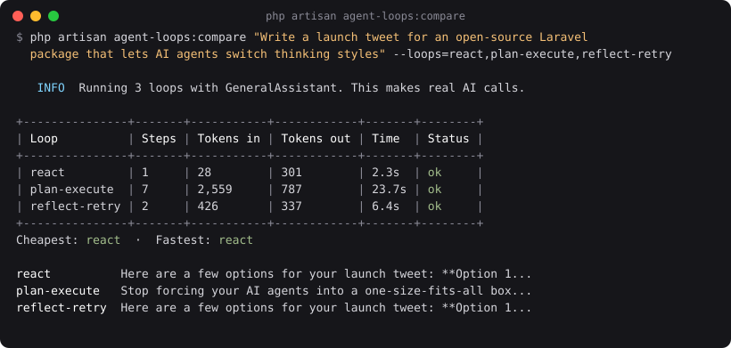
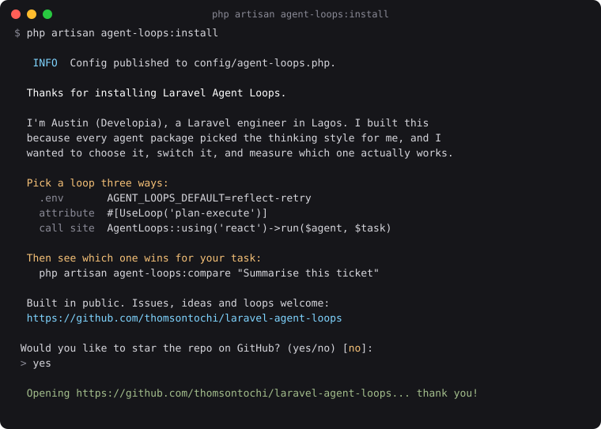

# Laravel Agent Loops

[](https://github.com/thomsontochi/laravel-agent-loops/actions/workflows/tests.yml)
[](https://packagist.org/packages/thomsontochi/laravel-agent-loops)
[](https://www.php.net)
[](https://laravel.com)
[](LICENSE)

**Give your agent a mindset.**

Pick your AI agent's thinking strategy. Switch it with one line. Benchmark which one works best for your task.

A Laravel agent harness with swappable loops, built on the official Laravel AI SDK.



## Why

An AI agent works in a cycle: think, use a tool, check, repeat. That cycle is the **loop**, and it decides a lot: how many AI calls a task takes, how long it runs, and how good the answer is.

Most agent packages pick the loop for you, and you never see it. This package makes the loop a choice. Run your agent step by step, make it plan first, or make it review its own work. Then compare them on your real tasks, with real numbers, instead of guessing.

It sits on top of the official [Laravel AI SDK](https://laravel.com/docs/ai-sdk). Your agents, tools and providers stay exactly as they are. Only the thinking style changes.

## What real numbers look like

The screenshot above is a real run with Gemini, on the task *"Write a launch tweet for an open-source Laravel package that lets AI agents switch thinking styles"*:

| Loop | Steps | Tokens in | Tokens out | Time |
|---|---|---|---|---|
| `react` | 1 | 28 | 301 | 2.3s |
| `plan-execute` | 7 | 2,559 | 787 | 23.7s |
| `reflect-retry` | 2 | 426 | 337 | 6.4s |

Two honest findings from that run:

- **Plan-execute cost about 10x more and took 10x longer, but it was the only loop that wrote one tweet.** The others returned a menu of options. A single tweet isn't really a multi-step task, so plan-execute spent most of its tokens rewriting the same draft.
- **The reviewer approved the wrong answer.** It called a list of options *"excellent"* for a task that asked for one tweet. After making the reviewer stricter, reflect-retry rejected the list, retried, and returned a single tweet: 4 steps, 1,202 tokens in, 514 out, 7.5s.

That's the point of this package: the trade-offs are real, and they depend on your task. Measure them.

## Requirements

- PHP 8.4+
- Laravel 13
- [laravel/ai](https://laravel.com/docs/ai-sdk) with at least one provider configured

## Installation

```bash
composer require thomsontochi/laravel-agent-loops
php artisan agent-loops:install
```

The install command publishes `config/agent-loops.php` (it never overwrites an existing one unless you pass `--force`) and shows you where to start.



## Quick start

Take any Laravel AI agent:

```php
use Laravel\Ai\Contracts\Agent;
use Laravel\Ai\Promptable;

class SupportAgent implements Agent
{
    use Promptable;

    public function instructions(): string
    {
        return 'You answer customer questions about orders.';
    }
}
```

And run it through a loop:

```php
use Developia\AgentLoops\Facades\AgentLoops;

$result = AgentLoops::run(new SupportAgent, 'Where is order 1234?');

$result->output;        // the final answer
$result->loop;          // "react"
$result->inputTokens;   // tokens sent
$result->outputTokens;  // tokens received
$result->durationMs;    // how long it took
$result->steps;         // what happened, in order
```

## Pick a loop, three ways

See every loop you have, what each one does, and which is the default:

```bash
php artisan agent-loops:list
```

Loops you register yourself in `config/agent-loops.php` show up there too.

The most specific choice wins.

**1. At the call site** (highest priority):

```php
AgentLoops::using('plan-execute')->run($agent, $task);
```

**2. On the agent class**, for agents that have a best style:

```php
use Developia\AgentLoops\Attributes\UseLoop;

#[UseLoop('reflect-retry')]
class CopywriterAgent implements Agent
{
    use Promptable;

    // ...
}

AgentLoops::run(new CopywriterAgent, $task); // runs reflect-retry
```

**3. App-wide in `.env`** (lowest priority):

```env
AGENT_LOOPS_DEFAULT=react
```

## The loops

Every loop adds one grounding line to the prompts it sends: *answer only from the facts in the task and your instructions, and if a fact is missing, say so instead of inventing it.* It lowers made-up links, dates and offers. It doesn't make them impossible, so the clearer your agent's own rules, the better.

| Loop | How it thinks | AI calls | Best for |
|---|---|---|---|
| `react` | Think, use a tool, look, repeat. Laravel AI's native tool loop. | 1 prompt | Quick questions and simple tool use |
| `plan-execute` | Writes a plan first, runs each step with the results so far, then answers. | 1 + steps + 1 | Multi-part tasks where order matters |
| `reflect-retry` | Answers, has a reviewer check the work, retries with the feedback. | 2 to 6 by default | Writing, code and summaries where quality matters |

### react

Runs your agent once and records what happened. Laravel AI already runs the think, act, look cycle inside `prompt()`, so this loop is the honest baseline everything else is compared against. Steps: one `tool_call` per tool used, then the `answer`.

### plan-execute

1. **Plan:** a small planning agent turns the task into steps, using structured output, so the plan is always valid JSON.
2. **Execute:** your agent runs each step and sees the results of the earlier ones.
3. **Answer:** your agent writes the final answer from all the step results.

Plans longer than `max_steps` are trimmed. Steps: `plan`, then one `step` per step, then `answer`.

If planning fails (an empty or broken plan), it degrades gracefully and reports loudly. It falls back to `react` so you still get an answer, logs a warning, fires a `PlanningFailed` event, and flags the result:

```php
if ($result->fellBack()) {
    // planning failed, the answer came from react
}
```

Prefer a hard stop? Set `AGENT_LOOPS_ON_PLANNING_FAILURE=throw` to get a `PlanningFailedException` instead.

Provider outages (overloaded, rate limited, unreachable) are not treated as planning failures. They pass straight through, because falling back would only hit the same provider again.

### reflect-retry

1. **Attempt:** your agent does the task.
2. **Review:** a strict reviewer approves it, or rejects it with specific feedback.
3. **Retry:** if rejected, your agent tries again with the feedback, up to `max_retries` times.

If it's still not approved, you get the last attempt, a warning in the log, and a flag:

```php
if (! $result->approved()) {
    // the reviewer never approved this answer
}
```

Steps: `attempt`, `review_rejected` or `review_approved`, and `not_approved` if it ran out of retries.

## Which loop should I use?

Start with `react`. It's the cheapest and fastest, and it's enough for most questions and simple tool use. Then move up only when you can see why:

| If your task... | Try | Because |
|---|---|---|
| Is a quick question or a single tool call | `react` | 1 prompt, lowest cost and latency |
| Has several parts that depend on each other (research, then summarise, then format) | `plan-execute` | Each step sees the earlier results |
| Must come out in an exact form (one tweet, valid code, a set word count) | `reflect-retry` | A reviewer rejects answers that miss the brief |
| Must follow rules where a mistake costs money (refund policy, pricing, legal) | `reflect-retry` | It's the only loop that re-reads your rules before answering |
| You're not sure | `agent-loops:compare` | Measure it on your real task instead of guessing |

**What our own tests found** ([real outputs in `examples/`](examples)): with vague rules, `react` and `plan-execute` both sent a customer to a returns portal the store doesn't have, and only `reflect-retry` caught it. Once the agent's rules said plainly "never say anything outside these instructions", all three loops answered correctly, so the cheapest one, `react`, was the right pick. Fix your instructions first, then use `compare` to check which loop is enough.

A real example from the run above: for a single tweet, `plan-execute` cost about 10x more than `react`, because a tweet isn't really a multi-step task. `reflect-retry` was the one that caught the "list of options instead of one tweet" problem.

## Compare loops on your own tasks

From the terminal:

```bash
php artisan agent-loops:compare "Summarise this support ticket" --loops=react,reflect-retry
```

| Option | What it does |
|---|---|
| `--loops=` | Comma-separated loop names. Default: all three |
| `--agent=` | Your agent class, e.g. `"App\Ai\Agents\SupportAgent"`. Default: a built-in assistant |
| `--judge` | Also scores each answer 1 to 10 with a judge agent. The judge gets your agent's instructions as the rules to check. One extra AI call |
| `--full` | Prints every answer in full instead of a short preview |
| `--json` | Prints the report as JSON, for scripts, CI and saving results |

> **Read the answers, not just the scores.** In a real run, our support agent's rules said *"We never offer free or prepaid labels."* One loop promised a prepaid return label anyway, and the judge, with those rules in front of it, still scored it 10/10. In another run it gave 3/10 to an answer that broke no rule. AI judges skim. Treat the score as a second opinion and use `--full` to read what each loop actually said before you pick one. The judge can also over-reward answers that recite the rules, even when the user only asked a simple question.

Or from code:

```php
$report = AgentLoops::compare($agent, $task, ['react', 'plan-execute'], judge: true);

$report->results;       // loop name => result
$report->cheapest();    // fewest total tokens
$report->fastest();     // shortest run
$report->best();        // highest judge score, or null when not judged
$report->failures;      // loop name => error message
$report->judgeFailure;  // error message if the judge itself failed, else null
```

**It keeps going when a loop fails.** If the provider is overloaded halfway through, the loops that already ran keep their results, the failed one shows as `failed` with the reason, and the command exits with code `1` so scripts notice. A typo in a loop name fails before any AI call is made, so it never costs you anything.

The JSON output looks like this:

```json
{
  "task": "...",
  "results": {
    "react": {
      "loop": "react",
      "output": "...",
      "steps": [{ "type": "answer", "content": "..." }],
      "inputTokens": 28,
      "outputTokens": 301,
      "durationMs": 2300.4,
      "cost": 0.000459
    }
  },
  "failures": { "plan-execute": "AI provider [gemini] is overloaded." },
  "judgeFailure": null,
  "scores": {},
  "summary": { "cheapest": "react", "fastest": "react", "best": null }
}
```

### Use it in CI

Because `--json` prints only JSON and the command exits with `1` when any loop fails, it works as a benchmark step:

```bash
php artisan agent-loops:compare "Summarise this ticket" --loops=react,reflect-retry --json > results.json

# e.g. pull the cheapest loop and each loop's total tokens
jq -r '.summary.cheapest' results.json
jq -r '.results | to_entries[] | "\(.key): \(.value.inputTokens + .value.outputTokens) tokens"' results.json
```

## Estimated cost

`agent-loops:compare` shows a **Cost (est.)** column, and every `LoopResult` has a `cost` in dollars:

```
| Loop         | Steps | Tokens in | Tokens out | Time | Cost (est.) | Status |
| react        | 1     | 312       | 254        | 1.9s | $0.000459   | ok     |
| plan-execute | 5     | 4,870     | 1,940      | 9.4s | $0.004128   | ok     |
```

How it works:

- Each AI response says which model answered. That call is priced at that model's rate and added to the run's total, so a planner or reviewer on a different model from your agent is still priced correctly.
- Prices live in `pricing` in `config/agent-loops.php`, in dollars per 1M tokens, for current Gemini, OpenAI and Anthropic models (checked 7 Oct 2026, links in the file).
- A model with no price shows `-`. If any call in a run has no price, the whole run shows `-` rather than a total that leaves a call out.
- Add a model or change a price by listing just that model under `pricing` in your config. Your entries are merged on top of the built-in list, model by model, so you don't lose the others.
- The judge's call is not included.

It's an **estimate**: cached-token discounts, batch pricing, free tiers and higher rates for very long prompts are not counted. Check your provider's dashboard for the real bill.

## Configuration

```bash
php artisan vendor:publish --tag=agent-loops-config
```

| Setting | Env | Default | What it does |
|---|---|---|---|
| `default` | `AGENT_LOOPS_DEFAULT` | `react` | Loop used when nothing more specific is chosen |
| `loops` | | the 3 built-in loops | Loop name => class. Add your own here |
| `plan_execute.max_steps` | `AGENT_LOOPS_MAX_STEPS` | `5` | Longest plan allowed. Longer plans are trimmed |
| `plan_execute.on_planning_failure` | `AGENT_LOOPS_ON_PLANNING_FAILURE` | `fallback` | `fallback` to react, or `throw` |
| `reflect_retry.max_retries` | `AGENT_LOOPS_MAX_RETRIES` | `2` | Redos after a rejected review. 2 means up to 3 attempts |
| `pricing` | | current Gemini, OpenAI and Anthropic models | Dollars per 1M tokens per model ID, for the Cost (est.) column. Your entries are added on top |

The planner, reviewer and judge agents use your app's default AI provider from `config/ai.php`.

## Write your own loop

This is a harness, not a fixed set of loops. Implement the `Loop` contract:

```php
use Developia\AgentLoops\Contracts\Loop;
use Developia\AgentLoops\LoopResult;
use Laravel\Ai\Contracts\Agent;

final class TwiceLoop implements Loop
{
    public function name(): string
    {
        return 'twice';
    }

    public function run(Agent $agent, string $task): LoopResult
    {
        $start = hrtime(true);

        $draft = $agent->prompt($task);
        $final = $agent->prompt("Improve this answer:\n\n{$draft->text}");

        return new LoopResult(
            loop: $this->name(),
            output: $final->text,
            steps: [
                ['type' => 'draft', 'content' => $draft->text],
                ['type' => 'answer', 'content' => $final->text],
            ],
            inputTokens: $draft->usage->inputTokens + $final->usage->inputTokens,
            outputTokens: $draft->usage->outputTokens + $final->usage->outputTokens,
            durationMs: (hrtime(true) - $start) / 1_000_000,
        );
    }
}
```

Register it in `config/agent-loops.php`:

```php
'loops' => [
    'react' => ReActLoop::class,
    'plan-execute' => PlanExecuteLoop::class,
    'reflect-retry' => ReflectRetryLoop::class,
    'twice' => App\Loops\TwiceLoop::class,
],
```

Now it works everywhere the built-in loops do: `AgentLoops::using('twice')`, `#[UseLoop('twice')]`, `AGENT_LOOPS_DEFAULT=twice`, and `agent-loops:compare --loops=react,twice`. Loops are resolved through Laravel's container, so constructor injection works.

## Events

| Event | When | Properties |
|---|---|---|
| `Developia\AgentLoops\Events\PlanningFailed` | plan-execute couldn't get a plan and fell back | `agent`, `task`, `reason` |

```php
use Developia\AgentLoops\Events\PlanningFailed;
use Illuminate\Support\Facades\Event;

Event::listen(PlanningFailed::class, function (PlanningFailed $event) {
    // alert your team: Slack, Sentry, email...
});
```

## Testing your agents

Everything works with Laravel AI's fakes, so your tests never make real AI calls:

```php
use App\Ai\Agents\SupportAgent;
use Developia\AgentLoops\Facades\AgentLoops;
use Developia\AgentLoops\Planning\Planner;
use Developia\AgentLoops\Reflection\Reviewer;

it('answers with react', function () {
    SupportAgent::fake(['Your order ships tomorrow.']);

    $result = AgentLoops::using('react')->run(new SupportAgent, 'Where is my order?');

    expect($result->output)->toBe('Your order ships tomorrow.');
});

it('plans first with plan-execute', function () {
    Planner::fake([['steps' => ['Look up the order', 'Write the reply']]]);
    SupportAgent::fake(['Order found', 'Draft reply', 'Your order ships tomorrow.']);

    $result = AgentLoops::using('plan-execute')->run(new SupportAgent, 'Where is my order?');

    expect($result->output)->toBe('Your order ships tomorrow.');
});

it('retries until the reviewer approves', function () {
    SupportAgent::fake(['A long rambling reply', 'Your order ships tomorrow.']);
    Reviewer::fake([
        ['approved' => false, 'feedback' => 'Too long.'],
        ['approved' => true, 'feedback' => 'Good.'],
    ]);

    $result = AgentLoops::using('reflect-retry')->run(new SupportAgent, 'Where is my order?');

    expect($result->approved())->toBeTrue();
});
```

The comparison judge can be faked the same way with `Developia\AgentLoops\Comparison\Judge::fake()`.

## Contributing

Issues, ideas and new loops are welcome. See [CONTRIBUTING.md](CONTRIBUTING.md) for how to add a loop. To work on the package:

```bash
git clone https://github.com/thomsontochi/laravel-agent-loops.git
cd laravel-agent-loops
composer install
composer test     # Pint style check + Pest
composer format   # fix code style
```

## Credits

Built in public by [Austin Opia (Developia)](https://austinopia.aidevelopia.com), on top of the [Laravel AI SDK](https://laravel.com/docs/ai-sdk).

[LinkedIn](https://www.linkedin.com/in/developia) · [X](https://x.com/SirAlexthomson) · [Newsletter](https://developia.substack.com)

## License

MIT. See [LICENSE](LICENSE).
